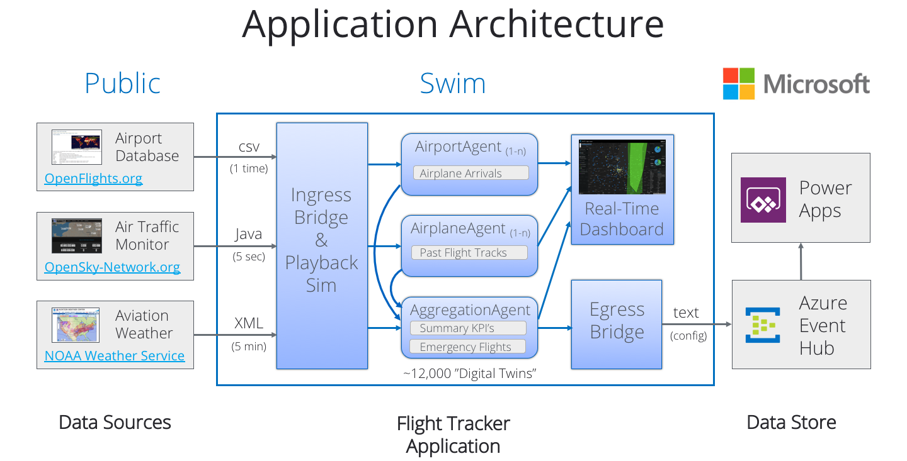

# TAAS FlightTrack Demo - To be created a generic TAAS Factory Automation DEMO

Java9+ is required to run the application. Gradle is also required but handled by Gradle wrapper and so will install automatically.

## Runing for Debugging and Development

1. git clone https://github.com/aimwts/flightinfo.git
2. cd flightinfo
3. chmod -R 755 *
4. chmod +x *.sh
3. ./debugSim.sh - fires up gradle build for sim
4. Open another command prompt
5. ./debugApp.sh - fires up gradle build for main app

## Package and Run on Live/Production Server

1. ./package.sh - Build and package both sim and main app into jar files. Only run this is you have made code changes.
2. ./run.sh - Run both sim and main app

## Stopping the app
1. ./stopall.sh - this does a 'killall java' to stop both sim and app

### Notes:
* When running live/production scripts, the application log files will be written to project base directory. 
* When started using the run.sh script, use `tail -f app.* sim.*` to watch the logs for errors or other information.
* Environmental Values which define Event Hub Configuration live in the run.sh and debug*.sh shell scripts.

## Basic App Folder Structure

* **/rawData/in** - Location of raw csv files which are read in by the simulator
* **/server** - codebase for Main Application
* **/simulator** - codebase for Simulator
* **/templates** - collection of JSON files which define various page layouts in the UI
* **/ui** - codebase for web based UI

## TAAS/Swim Application Structure

* Main App entry point is /server/src/main/java/swim/flightinfo/FlightInfoPlane.java
* Simulator entry point is /simulator/src/main/java/swim/flightinfo/FlightInfoPlane.java
* WebAgents live in 'agents' folder in each app
* Event Hub configuration values are defined in the shell scripts used to start the app & sim 

## Web UI

### Web UI served by swim and so the pages are at the same address as Swim itself
1. The main application runs at http://[server ip]:9001 
2. The Simulator runs at http://[server ip]:9002/wayback.html
